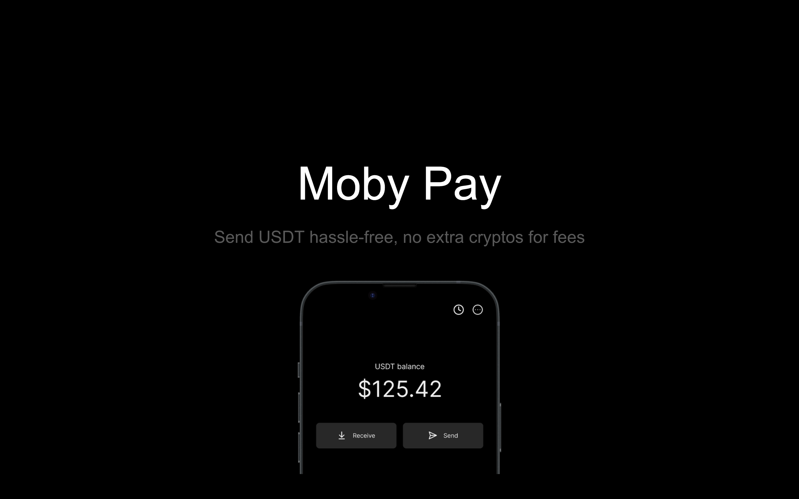

<p align="center">

</p>
<p align="center"><a href="https://www.loom.com/share/942fc46af20342348867329776ab396e?sid=a9b1d465-d6ea-4841-a745-7d55f772eb12">Demo video</a></p>
</p>

## Project overview

[Pitch deck](https://docs.google.com/presentation/d/13XErKEBY23cdp57FYG2G1OR9_SUaE3LO2ysOJL96VBs/edit?pli=1#slide=id.p)

[Figma UI preview](https://www.figma.com/embed?embed_host=share&url=https%3A%2F%2Fwww.figma.com%2Fproto%2F4Oc8DkVmMoj5to6z7vPlGh%2FMobile-APP%3Fpage-id%3D5907%253A7324%26type%3Ddesign%26node-id%3D6007-181%26viewport%3D302%252C797%252C0.59%26t%3DCMQEvwBMS3TMZtiF-1%26scaling%3Dscale-down%26starting-point-node-id%3D6007%253A181%26mode%3Ddesign)

## Installation

```
yarn install
yarn start -c
```

## Tech stack

### Expo React Native

### Polkadot.js

I followed along the [Front-end development basics & backend authentication for Polkadot workshop](https://www.youtube.com/watch?v=OYIbkJ92wuc&feature=youtu.be) to setup the Polkadot client and api connection, and modified the code to connect to Westend Asset Hub and called the assets.transferKeepAlive while supplying a sufficient token (Joe Test Token, asset_id 8) to pay for the transaction fee.

```typescript
//Workshop code

const wsProvider = new WsProvider("wss://westend-rpc-polkadot.io");
const api = await ApiPromise.create({ provider: wsProvider });

const tx = api.tx.balance.transferKeepAlive(
  "5C4hrfjw9DjXZTzV3MwzrrAr9P1MJhSrvWGWqi1eSuyUpnhM",
  1337
);

tx.signAndSend(
  accountConnected[0].address,
  { signer: injector.signer },
  ({ status }) => {
    if (status.isInBlock) {
      console.log(`Completed at block hash #${status.asInBlock.toString()}`);
    } else {
      console.log(`Current status: ${status.type}`);
    }
  }
);

// My modifications

// 1. I did not use web3 extension injection to get the account. I used polkadot.js library to generate a mnemonics, and establish a keypair with the mnemonics.
const keyring = new Keyring({ type: "sr25519" });
const newPair = keyring.addFromUri(newMnemonics!);
setAccount(newPair);

// 2. I called assets.transferKeepAlive.
const transferExtrinsic = api.tx.assets.transferKeepAlive(
  8,
  recipient,
  BigInt(amountToSend)
);

// 3. I supplied an asset_id in the signAndSend function's options to trigger ChargeAssetTxPayment, paying transaction fee with a sufficient token (Joe Test Token).
transferExtrinsic
  .signAndSend(
    account,
    {
      assetId: {
        parents: 0,
        interior: {
          X2: [{ PalletInstance: 50 }, { GeneralIndex: 8 }],
        },
      },
    },
    ({ status }) => {
      if (status.isInBlock) {
        console.log(`Completed at block hash #${status.asInBlock.toString()}`);
      } else {
        console.log(`Current status: ${status.type}`);
      }
    }
  )
  .catch((error: any) => {
    console.log(":( transaction failed", error);
  });
```
