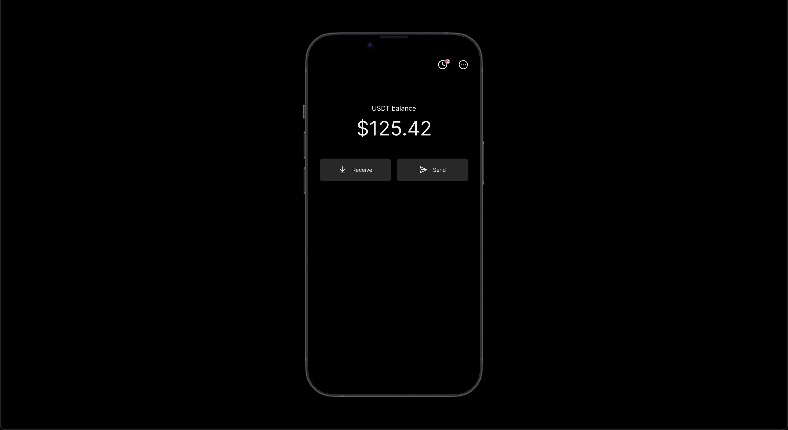

# Moby APP

<p align="center">

<p align="center">WIP - Frictionless stablecoin wallet</p>
<p align="center">Objective - Keep it extremely <b>simple</b> and <b>safe</b> for my grandma to use.</p>
<p align="center"><a href="https://www.figma.com/embed?embed_host=share&url=https%3A%2F%2Fwww.figma.com%2Fproto%2F4Oc8DkVmMoj5to6z7vPlGh%2FMobile-APP%3Fpage-id%3D5907%253A7324%26type%3Ddesign%26node-id%3D6007-181%26viewport%3D302%252C797%252C0.59%26t%3DCMQEvwBMS3TMZtiF-1%26scaling%3Dscale-down%26starting-point-node-id%3D6007%253A181%26mode%3Ddesign">Link to Figma preview</a></p>
</p>

## Installation

```
yarn install
yarn ios
```
